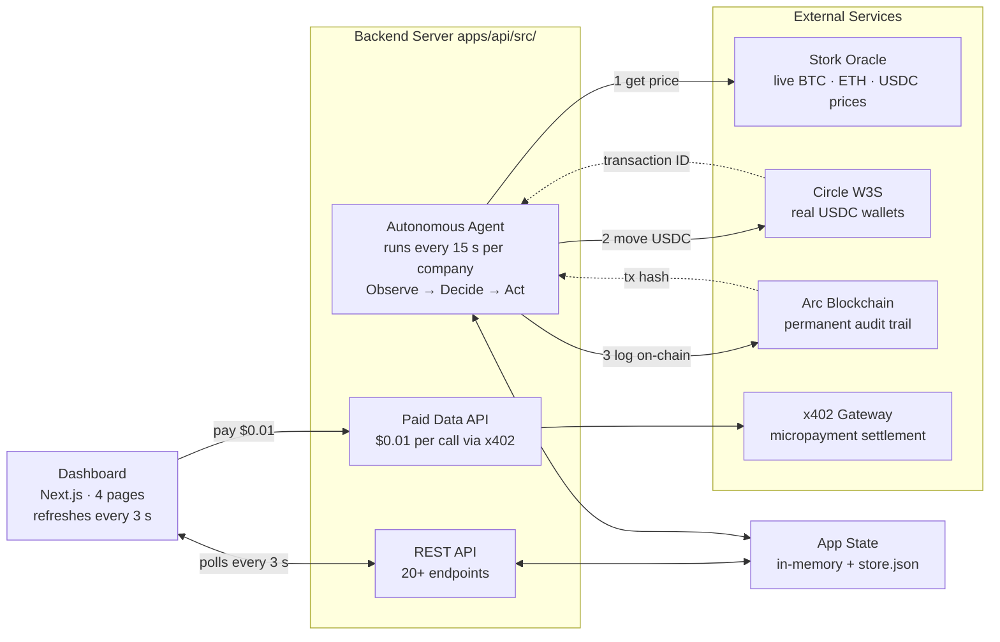
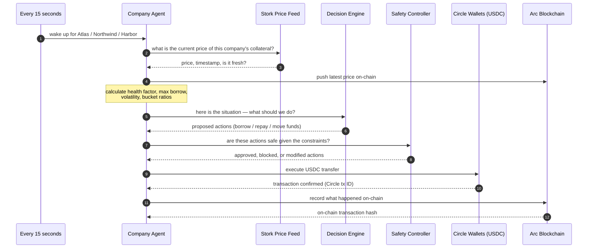

# RWA Credit Guardian — Architecture

**Encode × Arc Hackathon** · Next.js · Express · Stork · Circle W3S · Arc EVM · x402

---

## What We Built

RWA Credit Guardian is a platform that lets companies use real-world assets (like T-Bills, ETH, or BTC) as collateral to borrow USDC — and manages the entire credit lifecycle autonomously, without human intervention.

Every 15 seconds, an AI agent checks the current market price of each company's collateral, decides whether to borrow more USDC, repay some debt, or move funds between buckets to stay safe — then executes real USDC transfers through Circle wallets and writes a permanent audit record to a smart contract on Arc.

Three companies run simultaneously on the same engine, each with a different appetite for risk.

---

## Table of Contents

- [The Big Picture](#the-big-picture)
- [The Three Companies](#the-three-companies)
- [How the Agent Makes Decisions](#how-the-agent-makes-decisions)
- [How USDC Actually Moves](#how-usdc-actually-moves)
- [What Gets Recorded On-Chain](#what-gets-recorded-on-chain)
- [Scenario Walkthroughs](#scenario-walkthroughs)
- [What Can Go Wrong](#what-can-go-wrong)
- [Code Map](#code-map)

---

## The Big Picture



The agent runs a continuous loop — **observe prices → decide what to do → act with real money → prove it on-chain**. The dashboard reflects the live state within 3 seconds of any action.

---

## The Three Companies

To demonstrate the platform's flexibility, we simulate three companies with different risk tolerances — all running on the same engine, just with different parameters.

| Company | Risk Style | Collateral | Price Feed | Max Debt vs Collateral | Min Safety Ratio | Spending Limit |
|---------|-----------|-----------|-----------|----------------------|-----------------|----------------|
| **Atlas** | Conservative | 150 T-Bill units | USD/USDC | 50% | 1.80× | $3/day |
| **Northwind** | Balanced | 0.04 ETH | ETH/USD | 60% | 1.40× | $5/day |
| **Harbor** | Growth | 0.001 BTC | BTC/USD | 70% | 1.25× | $8/day |

**A few terms explained:**

- **Collateral** — the asset a company pledges as security. If BTC is worth $85,000 and Harbor holds 0.001 BTC, the collateral is worth $85.
- **Max debt vs collateral (LTV)** — Harbor at 70% LTV can borrow up to $59.50 against that $85 of collateral.
- **Safety ratio (Health Factor)** — how far the company is from getting into trouble. A ratio of 1.45 means the company has 45% more headroom than required. Below 1.0 means insolvent. The agent's job is to keep this above the minimum.
- **Spending limit** — hard daily cap enforced both in the backend and on the smart contract.

---

## How the Agent Makes Decisions

Every 15 seconds, the agent runs this exact pipeline for each company:



> If the previous tick is still running when the next one fires, it is skipped entirely — the agent never runs two ticks in parallel for the same company.

### The Decision Brain — 12 Rules

The brain (`planner.ts`) checks 12 rules in priority order and proposes actions. Think of it like a checklist a treasury manager would run through:

| Priority | What it checks | What it does |
|---------|----------------|-------------|
| 1 | Safety ratio dropped too low | Repay debt immediately to recover |
| 2 | Market is volatile and ratio is borderline | Repay proactively before it gets worse |
| 3 | A payment is queued and waiting | Borrow or pull from reserve to fund it |
| 4 | Operational cash (liquidity) is running low | Pull from the reserve bucket |
| 5 | Operational cash is low and borrowing is safe | Borrow fresh USDC |
| 6 | Liquidity is below its target ratio | Borrow or rebalance up to target |
| 7 | Liquidity is critically low, yield bucket has funds | Pull from yield as emergency |
| 8 | Reserve is below target, yield bucket has funds | Refill reserve from yield |
| 9 | Reserve is healthy, yield rate is good | Park excess reserve into yield |
| 10 | Reserve is below its target | Move excess liquidity into reserve |
| 11 | Market is volatile — strengthen the safety buffer | Move liquidity into reserve |
| 12 | Safety ratio has room to improve | Proactively repay to push ratio higher |

### The Safety Controller — 10 Hard Limits

Before any action is executed, the safety controller (`safetyController.ts`) acts as a second layer that can block or reduce any proposed action. These are non-negotiable guardrails:

| Guardrail | What it prevents |
|-----------|-----------------|
| Emergency override | If safety ratio is critically low, it scraps the plan and forces a repay |
| Safety ratio block | If ratio is below minimum, only debt-reducing actions are allowed |
| Stale price block | If the price feed is over 1 hour old or simulated, no borrowing allowed |
| Per-transaction cap | Each action is capped at a maximum USDC amount (halved during volatility) |
| Daily spending limit | Blocks borrowing/payments once the daily cap is exhausted |
| Liquidity hard floor | Never drains operational cash below 50% of the minimum threshold |
| LTV enforcement | New debt cannot push the company past its maximum borrow limit |
| Volatility reduction | During volatile markets, borrow headroom is reduced by 30% |
| Yield allocation cap | Limits how much of the total pool can be in yield |
| Yield rate gate | Only deploys to yield if the APY is worth it |

---

## How USDC Actually Moves

Each company's USDC is split across four purpose-built Circle wallets. Think of them as bank accounts with specific roles:

```
┌─────────────────┐     borrow      ┌─────────────────┐
│  Credit         │ ─────────────► │  Liquidity       │
│  Facility       │ ◄───────────── │  (operational    │
│  (debt pool)    │     repay       │   cash)          │
└─────────────────┘                └────────┬─────────┘
                                            │ rebalance (both ways)
                                   ┌────────▼─────────┐
                                   │  Reserve          │
                                   │  (safety buffer)  │
                                   └────────┬──────────┘
                                            │ rebalance (both ways)
                                   ┌────────▼──────────┐
                                   │  Yield             │
                                   │  (earning APY)    │
                                   └───────────────────┘
                    Liquidity ─── payment ───► External address
```

Every transfer is a real Circle W3S API call with RSA-encrypted authentication and a unique idempotency key to prevent double-spends.

---

## What Gets Recorded On-Chain

The `GuardianVault` smart contract on Arc (`0x10F29AA6BFF6E3154f09bf1122D64fE63AfC1911`) is the platform's permanent ledger. It does two things:

1. **Enforces rules** — the contract independently checks that a borrow doesn't exceed the LTV limit, and that payments don't exceed daily caps. Even if the backend has a bug, the contract is the last line of defence.
2. **Creates an audit trail** — every action emits an event with the Circle transaction ID embedded, so anyone can cross-reference what moved in Circle wallets against what was recorded on-chain.

| What happened | On-chain function | Event emitted |
|--------------|------------------|---------------|
| Company pledged collateral | `registerCollateral()` | `CollateralRegistered` |
| Company borrowed USDC | `recordBorrow()` | `BorrowRecorded` |
| Company repaid debt | `recordRepay()` | `RepayRecorded` |
| Funds moved between buckets | `recordRebalance()` | `RebalanceRecorded` |
| Payment sent to recipient | `recordPayment()` | `PaymentRecorded` |
| Agent logged its reasoning | `logDecision()` | `AgentDecisionLogged` |
| Policy parameters updated | `setPolicy()` | `PolicySet` |
| Demo state reset | `resetUser()` | `UserReset` |

The Circle transaction ID is embedded in every on-chain record, so the two systems are permanently linked.

---

## Scenario Walkthroughs

<details>
<summary><strong>Borrow scenario</strong> — Harbor's BTC collateral supports taking on more debt</summary>

**Setup:** Harbor holds 0.001 BTC. BTC is trading at $85,000, so the collateral is worth $85. At 70% LTV, Harbor can borrow up to $59.50. Current debt is $41, so there is room to borrow more.

**What triggers it:** The agent notices that Harbor's operational cash (liquidity wallet) has dropped below the minimum threshold. Borrowing more is the right move.

**Step by step:**

```
1. Agent fetches BTC price from Stork → $85,000  (fresh, trusted)
2. Agent pushes price to Arc smart contract      (so the contract can verify LTV)
3. Agent calculates:
     collateral value = 0.001 × $85,000 = $85
     max borrow       = $85 × 70%       = $59.50
     health factor    = $59.50 / $41    = 1.45   (safe)

4. Planner proposes: borrow to refill liquidity
5. Safety controller checks:
     - Price is fresh and real (not simulated)       ✓
     - New debt stays within LTV                     ✓
     - Daily spending cap has room                   ✓
     - Per-transaction limit respected               ✓

6. Circle API call: move USDC from Credit Facility → Liquidity wallet
   (real transfer, RSA-encrypted, idempotent)
   ← Circle returns a transaction ID

7. Arc contract call: recordBorrow(Harbor address, amount, Circle tx ID)
   Contract re-checks LTV, adds to debt balance, emits BorrowRecorded event
   ← Arc returns a transaction hash

8. Agent logs decision on-chain: logDecision(snapshot, "borrow", reasonHash)

9. State updated in memory, logged to action history
10. Dashboard shows new debt and health factor within 3 seconds
```

</details>

<details>
<summary><strong>Repay scenario</strong> — Atlas proactively reduces debt while it can</summary>

**Setup:** Atlas is a conservative company. Its T-Bill collateral is stable (pegged to USD), its health factor is a comfortable 2.20, and it has idle cash sitting in its liquidity wallet doing nothing.

**What triggers it:** The agent notices the health factor has room to improve and there is excess liquidity — proactively paying down debt now makes Atlas more resilient to any future price moves.

**Step by step:**

```
1. Agent fetches USDC/USD price from Stork → ~$1.00 (stable)
2. Health factor = 2.20 — well above the 1.80 minimum
3. No emergency, no volatility spike

4. Planner proposes: proactive repay using idle liquidity
5. Safety controller approves (repays are never blocked by LTV rules)

6. Split-repay logic:
     Pull from liquidity first (keeping 0.50 USDC as gas reserve)
     Pull remainder from reserve if liquidity isn't enough

7. Two Circle API calls if needed:
     Liquidity wallet → Credit Facility wallet
     Reserve wallet   → Credit Facility wallet  (if liquidity ran short)
   ← Both return Circle transaction IDs, joined with "+"

8. Arc: recordRepay(Atlas address, amount, combined Circle tx IDs)
   Contract checks amount ≤ current debt, reduces debt balance,
   emits RepayRecorded event

9. Health factor recalculated after execution — now higher
10. Dashboard updates within 3 seconds
```

</details>

<details>
<summary><strong>Rebalance scenario</strong> — Northwind shifts funds after an ETH price drop</summary>

**Setup:** Northwind holds ETH as collateral. ETH just dropped 4% in price (or a demo shock was triggered). This pushes volatility above the 3% threshold and the health factor edges closer to the minimum.

**What triggers it:** The agent detects that markets are volatile. Even though the health factor hasn't breached the minimum, the right move is to strengthen the reserve buffer now — before things get worse.

**Step by step:**

```
1. Agent fetches ETH price from Stork → $2,400 (was $2,500)
2. Price change = -4% → flagged as volatile (threshold: 3%)
3. Health factor = ($2,400 × 0.04 × 60%) / $37 = 1.56
   (below target of 1.6, but above minimum of 1.4)

4. Planner proposes: move 50% of excess liquidity into reserve
   (Rule 11: proactive risk tightening during volatility)

5. Safety controller adjusts limits for volatile conditions:
     Effective liquidity minimum raised by 50%
     Hard floor = half of the minimum (never go below this)
   This specific move is a "risk tightening" action — allowed
   even if it brings liquidity below the raised minimum

6. Circle API call: Liquidity wallet → Reserve wallet
   (no new debt created — purely an internal reallocation)
   ← Circle returns a transaction ID

7. Arc: recordRebalance("liquidity", "reserve", amount, Circle tx ID)
   Note: this is audit-only — the contract does not enforce any
   rules for rebalances, it just logs that it happened

8. Agent logs decision on-chain with the reasoning

9. Dashboard shows Reserve wallet balance increased,
   Status shows "Risk Mode" to signal the agent responded to a threat
```

</details>

---

## What Can Go Wrong

We are being transparent about the current state of resilience:

| Scenario | Current Behaviour |
|---------|------------------|
| **Price feed goes stale** (no update for over 1 hour) | Handled — the agent marks the price as untrusted and blocks any borrowing until a fresh price arrives |
| **Circle API call fails** | Partial — the agent logs a warning and falls back to a simulated reference, but the in-memory state still updates. This could cause a temporary mismatch between real wallet balances and what the app thinks |
| **Two agent ticks fire at the same time** | Handled — a simple lock flag ensures the second tick is skipped entirely |
| **Arc transaction fails** | Partial — Arc failures are treated as non-fatal. The action still happens (USDC moves), but the on-chain audit record is missing |
| **Server restarts** | Partial — the per-company state is restored from `store.json`, but the Arc contract's on-chain state is the source of truth for debt and collateral. They are re-synced at startup, but divergence is possible if the restart happens mid-action |
| **Demo price shock doesn't clear** | Handled — simulated prices expire automatically after 5 minutes and real prices resume |
| **Daily spending resets at different times** | Known gap — the backend resets at midnight UTC, the smart contract resets 24 hours after the first payment of the day. These can drift |
| **Circle wallet addresses fail to load at startup** | Partial — wallet addresses are resolved asynchronously at boot. If this fails silently, real transfers will fail with an empty destination address |

---

## Code Map

| What it does | File |
|-------------|------|
| Smart contract (Arc) | [`contracts/GuardianVault.sol`](contracts/GuardianVault.sol) |
| Talks to the smart contract | [`apps/api/src/integrations/arc.ts`](apps/api/src/integrations/arc.ts) |
| Talks to Circle wallets | [`apps/api/src/integrations/circle.ts`](apps/api/src/integrations/circle.ts) |
| Fetches prices from Stork | [`apps/api/src/integrations/stork.ts`](apps/api/src/integrations/stork.ts) |
| Runs the 15-second loop | [`apps/api/src/agent/agentLoop.ts`](apps/api/src/agent/agentLoop.ts) |
| Runs one tick per company | [`apps/api/src/agent/companyAgentTick.ts`](apps/api/src/agent/companyAgentTick.ts) |
| Proposes actions (12 rules) | [`apps/api/src/agent/planner.ts`](apps/api/src/agent/planner.ts) |
| Enforces safety limits (10 rules) | [`apps/api/src/agent/safetyController.ts`](apps/api/src/agent/safetyController.ts) |
| Executes Circle + Arc calls | [`apps/api/src/agent/executor.ts`](apps/api/src/agent/executor.ts) |
| Holds all app state | [`apps/api/src/store.ts`](apps/api/src/store.ts) |
| REST API routes | [`apps/api/src/routes.ts`](apps/api/src/routes.ts) |
| Paid data API (x402) | [`apps/api/src/x402Routes.ts`](apps/api/src/x402Routes.ts) |
| Server startup | [`apps/api/src/index.ts`](apps/api/src/index.ts) |
| Platform dashboard | [`apps/web/pages/index.tsx`](apps/web/pages/index.tsx) |
| Atlas company page | [`apps/web/pages/company-atlas.tsx`](apps/web/pages/company-atlas.tsx) |
| Northwind company page | [`apps/web/pages/company-northwind.tsx`](apps/web/pages/company-northwind.tsx) |
| Harbor company page | [`apps/web/pages/company-harbor.tsx`](apps/web/pages/company-harbor.tsx) |
| Deploy the contract | [`hardhat/scripts/deploy.ts`](hardhat/scripts/deploy.ts) |
